# SmartImageAlbum

SmartImageAlbum is a cloud-native, horizontally scalable microservices backend for image upload, storage, and embedding-based similarity search to find visually similar pictures.

## 🚀 Features

* Content-based image similarity search
* Extensible microservices architecture (e.g. MinIO, Qdrant)
* Scalable and modular deployment via Docker

## ⚙️ Installation & Setup

### Prerequisites

* Python 3.9+
* Docker Desktop

### Local Deployment with Docker

```bash
git clone https://github.com/Nullpoint56/SmartImageAlbum.git
cd SmartImageAlbum
docker compose -f deployments/docker-compose.yml up -d
```

## 🏗️ Architecture

See the [architecture documentation](./docs/architecture_documentation.md) for detailed diagrams and service roles.

## 🔍 Usage

* **Upload** an image: `POST /images/upload`
* **Find similar images**: `GET /images/{image_id}/similar`
* **Retrieve image metadata**: `GET /images/{image_id}`

## 💡 Future Enhancements

* Support for additional embedding providers
* Docker image optimizations for smaller deployment footprint
* Web-based interface for album browsing and management
* Centralized configuration service for all components
