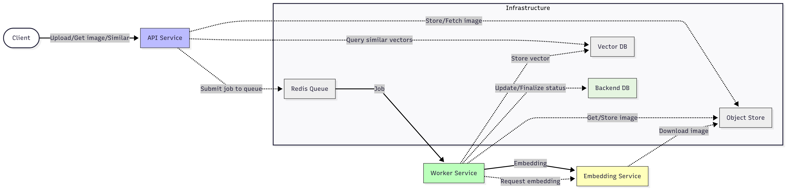

# SmartImageAlbum

SmartImageAlbum is a cloud-native, horizontally scalable microservices backend for image upload, storage, and embedding-based similarity search to find visually similar pictures.

## 🚀 Features

* Content-based image similarity search
* Extensible microservices architecture (e.g. MinIO, Qdrant)
* Scalable and modular deployment via Docker

## ⚙️ Installation & Setup

### Prerequisites

* Docker Desktop

### Local Deployment with Docker

```bash
git clone https://github.com/Nullpoint56/SmartImageAlbum.git
cd SmartImageAlbum
docker compose -f deployments/docker-compose.yml up -d
```

## 🏗️ Architecture

See the [architecture documentation](./docs/architecture_documentation.md) for detailed diagrams and service roles.

## 📄 Technology choices justification

Checkout the [tooling justification documentation](./docs/tooling_justification.md) for more details.


## 🔍 Usage

* **Upload** an image: `POST /images/upload`
* **Find similar images**: `GET /images/{image_id}/similar`
* **Retrieve image metadata**: `GET /images/{image_id}`

## 💡 Future Enhancements

* Support for additional embedding providers
* Docker image optimizations for smaller deployment footprint
* Web-based interface for album browsing and management
* Centralized configuration service for all components

## License

This project is licensed under a custom **"All Rights Reserved"** license.

Copyright © 2025 [Szombathy Tamás]

This software is provided for **educational and evaluation purposes only**.  
🚫 **Commercial or production use is strictly prohibited** without prior written permission from the author.

See the [LICENSE](./LICENSE) file for full terms.
